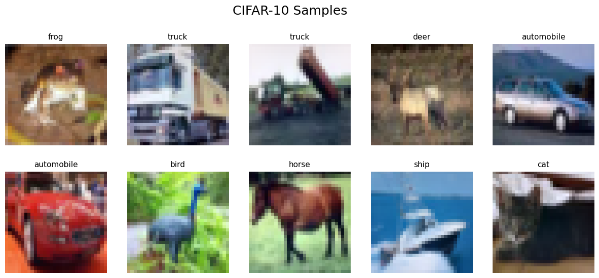

<div align="center" style="font-size: 1.4em; font-weight: bold;">
实验七、ResNet
</div>
<div style="display: flex; width: 100%; font-size: 1em;">
  <div style="flex: 1; text-align: left;">
    姓名：卢豪豪
  </div>
  <div style="flex: 1; text-align: center;">
    学号：202310310239
  </div>
  <div style="flex: 1; text-align: right;">
    指导老师：胡政伟
  </div>
</div>
<hr/>

### 一、实验目的
PyTorch 实现 ResNet-18 Model 对 CIFAR-10 数据集进行图像分类。

### 二、实验内容
#### 1、dataset
实验数据集合的话就是从 `torchvision.datasets` 导入的常用的 CIFAR-10 dataset。样本示例如下：




#### 2、Data Augmentation

使用 transforms 进行了一些常见的增强方式，对训练集的处理（测试集只归一化）包括：
- padding & RandomCrop；
- 随机水平翻转 RandomHorizontalFlip()；
- 归一化。

```python
transform_train = transforms.Compose([
    transforms.RandomCrop(32, padding=4),
    transforms.RandomHorizontalFlip(),
    transforms.ToTensor(),
    transforms.Normalize((0.4914, 0.4822, 0.4465), (0.2023, 0.1994, 0.2010)), # 常用的归一化设定
])

# Test 只 Norm
transform_test = transforms.Compose([
    transforms.ToTensor(),
    transforms.Normalize((0.4914, 0.4822, 0.4465), (0.2023, 0.1994, 0.2010)),
])
```

#### 3、ResNet
这里的话就直接利用了 `torchvision.models` 提供的预训练的 `resnet18`。没有 `requires_grad = False` 这样冻结
前面的一些层，直接就是全量微调。用了 DropOut ，`nn.Dropout` 训练开启，测试时其自动关闭。

```python
model = torchvision.models.resnet18(pretrained=True)

# 10 Cls
num_ftrs = model.fc.in_features
model.fc = nn.Sequential(nn.Dropout(0.5), nn.Linear(num_ftrs, 10))

model = model.to(device)
```

#### 4、训练
- Optimizer 就是 **SGD With Momentum**，然后多步衰减，15 个 epoch。

```python
criterion = nn.CrossEntropyLoss()
optimizer = optim.SGD(model.parameters(), lr=LEARNING_RATE, momentum=0.9, weight_decay=5e-4)
scheduler = optim.lr_scheduler.MultiStepLR(optimizer, milestones=[7, 12], gamma=0.1)
```
- 测试及评估实现如下，不再特意说明。
```python
train_losses, test_losses = [], []
train_accs, test_accs = [], []

def train(epoch):
    model.train()
    running_loss = 0.0
    correct = 0
    total = 0
    
    for inputs, labels in trainloader:
        inputs, labels = inputs.to(device), labels.to(device)
        
        optimizer.zero_grad()
        outputs = model(inputs)
        loss = criterion(outputs, labels)
        loss.backward()
        optimizer.step()
        
        running_loss += loss.item()
        _, predicted = outputs.max(1)
        total += labels.size(0)
        correct += predicted.eq(labels).sum().item()
    
    epoch_loss = running_loss / len(trainloader)
    epoch_acc = 100. * correct / total
    train_losses.append(epoch_loss)
    train_accs.append(epoch_acc)
    return epoch_loss, epoch_acc

def test(epoch):
    model.eval()
    running_loss = 0.0
    correct = 0
    total = 0
    
    with torch.no_grad():
        for inputs, labels in testloader:
            inputs, labels = inputs.to(device), labels.to(device)
            outputs = model(inputs)
            loss = criterion(outputs, labels)
            
            running_loss += loss.item()
            _, predicted = outputs.max(1)
            total += labels.size(0)
            correct += predicted.eq(labels).sum().item()
            
    epoch_loss = running_loss / len(testloader)
    epoch_acc = 100. * correct / total
    test_losses.append(epoch_loss)
    test_accs.append(epoch_acc)
    return epoch_loss, epoch_acc
```

#### 5、Visulization
最后 Seaborn 风格绘图（挺喜欢这个风格，常用这个😁），如下：


### 三、实验总结
1. 在多次运行时我发现，在第一次衰减后，Train & Test 的准确率差距总是会进一步增大；
2. 起初我认为是过拟合，但是加强正则化这种衰减后 Gap 拉大总是会发生，但是其实 Test 表现确也始终没有变差。此外就是前期甚至 Test 效果反而优于 Train。
3. 所以，结合上述，我的个人理解是可能与：Dropout 与 Data Augmentation 有关（不过暂未进一步实验验证）：
   1. 因为我 DropOut Ratio 设置的为 0.5 还是比较大的，然后训练打开验证关闭，这应该能解释为何前期 Test 效果更好；
   2. 学习率衰减，Model 逐渐“克服”了训练时的“随机噪声“”，导致 Train Acc 最终反超并拉开差距。
